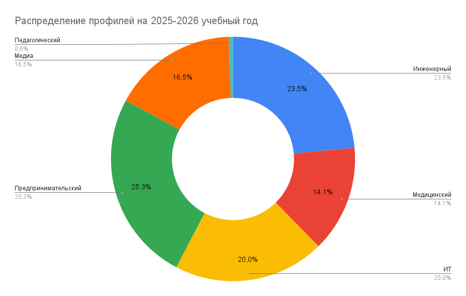
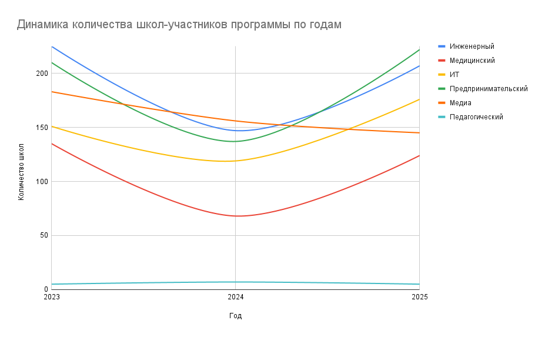
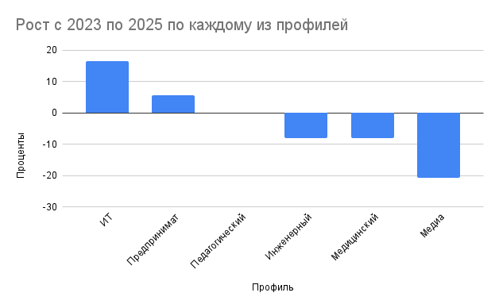

# Неравномерность доступа к предпрофессиональным классам в школах Москвы: динамика профилей в 2023/24–2025/26 учебных годах

## Синопсис

Исследование посвящено анализу инфраструктурного развития системы предпрофессионального образования в Москве. Работа фокусируется на динамике территориального и профильного распределения специализированных классов в 2023–2026 гг. Ключевая цель — выявить диспропорции в доступе к различным предпрофессиональным профилям и проверить связь между рейтинговыми показателями учебных заведений и их включенностью в городские проекты.

### Структура репозитория

```text
project/
├── README.md
├── data/
│   ├── raw/
│       ├── original/
│       └── converted/
│   └── clean.xlsx
├── visualizations/
└── scripts/
```

## Актуальность

По словам мэра Москвы, [Сергея Собянина](https://www.mos.ru/news/item/161213073/), сегодня предпрофессиональные классы открыты более чем в 70 процентах школ города. Но по направлениям картина резко различается: например, в 2025-2026 учебном году медиаклассы работают в 145 школах, тогда как психолого-педагогическое направление представлено лишь в пяти. Неизвестно насколько равномерно эти возможности развиваются по годам по районам и как часто школы берут сразу несколько направлений, а не одно. В итоге для семей и самих школьников выбор может зависеть не от интересов, а от того, есть ли нужный профиль рядом с домом.
 
Исследование поможет увидеть ситуацию целиком. Наглядные карты и сравнение динамики покажут, какие направления растут быстрее всего, где они концентрируются территориально и как устроена модель школ: чаще они специализируются на одном профиле или включают сразу несколько проектов. 

## Исследовательские вопросы

1. Как менялось число школ, участвовавших в каждом предпрофессиональном профиле, по учебным годам.
2. Какие профили росли быстрее других.
3. Как распределялись школы с предпрофессиональными профилями в пространстве города.
4. Была ли связана включенность школы в предпрофессиональные проекты с ее позицией в рейтинге топ-400 московских школ.

## Данные 

## Структура файла 'Clean.xlsx' и источники данных

| Лист | Описание | Источники данных |
|---|---|---|
| Главная таблица | В одной таблице собрана полная информация по каждой школе, которая фигурировала в исходных данных, включая адрес, рейтинг и конкретные программы предпрофессиональных классов. | Свод на основе всех источников ниже |
| Визуализация данных | Лист с основной статистикой, рассчитанной на основе главной таблицы и диаграммами, на основе этих таблиц. **Важно:** Excel не поддерживает часть таблиц и формул из Google Sheets, [ссылка](https://docs.google.com/spreadsheets/d/1mPMstdVvoULBMKsPrHwMt4wZAKJqc2nyvlU9s25KKD0/edit?usp=sharing) на документ отдельно | Главная таблица |
| Адреса школ | Лист использовался для сбора адресов большей части школ. Для нескольких недостающих школ адреса были найдены вручную. | [Список школ Москвы — Википедия](https://ru.wikipedia.org/wiki/Список_школ_Москвы) |
| Топ-400 | Лист использовался для анализа связи между положением школы в рейтинге и частотой участия в программах предпрофессиональных классов. Рейтинг составлен Департаментом образования и науки (ДОНМ). | [Рейтинг школ Москвы 2025](https://www.krylatskoye.ru/content/ratings/2025/08/rejting-shkol-moskvy-2025.html) |

### Данные по учебным годам и профилям

| Учебный год | Инженерный | Медицинский | ИТ | Педагогический | Медиа | Предпринимательский |
|---|---|---|---|---|---|---|
| 2023–2024 | [Приказ №926 от 27.09.2023](https://profil.mos.ru/media/images/documents/Prikaz_926_27_09_2023.pdf) | [Приказ №926 от 27.09.2023](https://profil.mos.ru/media/images/documents/Prikaz_926_27_09_2023.pdf) | [Приказ №926 от 27.09.2023](https://profil.mos.ru/media/images/documents/Prikaz_926_27_09_2023.pdf) | [Приказ №926 от 27.09.2023](https://profil.mos.ru/media/images/documents/Prikaz_926_27_09_2023.pdf) | [Приказ №926 от 27.09.2023](https://profil.mos.ru/media/images/documents/Prikaz_926_27_09_2023.pdf) | [Приказ №926 от 27.09.2023](https://profil.mos.ru/media/images/documents/Prikaz_926_27_09_2023.pdf) |
| 2024–2025 | [Приказ №753](https://profil.mos.ru/images/GMC/Inzhenernyj_klass/doc/O_proekte/Prikaz_753.pdf) | [Приказ №753](https://profil.mos.ru/images/GMC/Inzhenernyj_klass/doc/O_proekte/Prikaz_753.pdf) | [Школы 2024–2025 учебного года](https://profil.mos.ru/it/o-proekte/shkoly-2024-2025-uchebnyj-god.html) | [Приказ №893 от 11.09.2024](https://profil.mos.ru/images/GMC/Pedagogicheskij_klass/doc/Prikaz_893_11_09_24.pdf) | [Школы 2024–2025 учебного года](https://profil.mos.ru/media/shkoly-2024-2025-uchebnyj-god) | [Приказ №753](https://profil.mos.ru/images/GMC/Inzhenernyj_klass/doc/O_proekte/Prikaz_753.pdf) |
| 2025–2026 | [Школы 2025–2026 учебного года](https://profil.mos.ru/inj/o-proekte/shkoly-2025-2026-uchebnyj-god.html) | [Школы 2025–2026 учебного года](https://profil.mos.ru/med/o-proekte/shkoly-2025-2026-uchebnyj-god-1.html) | [Schools 2025 PDF](https://profil.mos.ru/images/GMC/IT_klass/doc/2025/Schools_2025.pdf) | [Schools 2025 PDF](https://profil.mos.ru/images/GMC/IT_klass/doc/2025/Schools_2025.pdf) | [Школы 2025–2026 учебного года](https://profil.mos.ru/media/shkoly-2025-2026-uchebnyj-god) | [Школы 2025–2026 учебного года](https://profil.mos.ru/ntek/o-proekte/shkoly-2025-2026-uchebnyj-god.html) |

## Процесс сбора и очистки

Основные списки школ по предпрофессиональным профилям были собраны из открытых источников, прежде всего с сайта `profil.mos.ru`, где данные публиковались в виде страниц проектов и приказов. Часть материалов была доступна в виде веб-страниц, часть только в формате PDF.

Данные, представленные на веб-страницах, были извлечены с помощью расширения **instant data scraper**. Данные, опубликованные в приказах, были переведены из PDF в формат таблиц с помощью инструмента [pdf_to_excel](https://www.ilovepdf.com/ru/pdf_to_excel). Таблица с рейтингом "Топ-400" была извлечена с помощью расширения **table capture**. 

Данные с Wikipedia с адресами школ были скопированы и преобразованы в csv файл (каждая школа на отдельной строке, "—" разделитель), после чего с помощью скрипта "index.py" были разделены адреса и индекса и вручную почищены некоторые места.

Для получения координат использовался сервис **Yandex Geocoder API** — с помощью нейросети был написан скрипт `api.js`, который был подключен напрямую к Google Таблицам. Скрипт получил каждый адрес школы и заполнил соответствующий столбец полученными координатами.

Для нормализации всех названий на листах с raw данными были созданы столбцы `Чистое название` — специальная формула чистила оригинальные названия приводя к виду "Школа НОМЕР" (если номер был) или "Школа КОРОТКОЕ НАЗВАНИЕ"

## Анализ

Анализ проводился в Google Sheets с помощью сводных таблиц, различных формул, а также последующей визуализации. 

### 1.  **Сравнительный анализ**: Расчет процентного соотношения классов по каждому профилю (Инженерный, ИТ, Медицинский и др.) для выявления дефицитных и профицитных направлений.



В 2025/26 учебном году структура предпрофессиональных профилей в Москве была выраженно неравномерной. Наибольшую долю составили предпринимательский профиль, 25,3 процента всех зафиксированных профильных включений, и инженерный профиль, 23,5 процента. Далее следовали ИТ, 20,0 процента, медиа, 16,5 процента, и медицинский профиль, 14,1 процента. Педагогическое направление занимало только 0,6 процента.

Это показывает, что система развивалась с явным перекосом в сторону технологических и прикладных направлений. Для школьников это означает разную доступность профилей в зависимости от выбранной траектории: поступить в инженерный, ИТ или предпринимательский класс заметно проще с точки зрения числа доступных школ, чем в педагогический.

### 2.  **Анализ динамики**: Расчет изменения количества профильных классов в период с 2023-2024 по 2025-2026 гг.



При построении сводной диаграммы по всем направлениям обнаружилась аномалия. В 2023/24 учебном году количество школ-участниц было высоким, но в 2024/25 году произошел резкий спад почти по всем профилям. К 2025/26 году показатели большинства направлений вернулись к прежним значениям или даже превысили их.

Исключением стал **педагогический профиль**, который сохраняет стабильно низкие показатели (5–7 школ)

#### Причины изменений
Изучение нормативных актов Департамента образования и науки города Москвы (ДОНМ) показало, что этот «провал» мог быть вызван административной реформой. В 2023–2024 годах был введен [**Единый стандарт предпрофессионального образования**](https://www.mos.ru/donm/documents/normativnye-pravovye-akty/view/309267220/).

Вероятные причины падения показателей в 2024 году:
1.  **Жесткая аккредитация.** Школы обязали соответствовать новым требованиям: наличие лабораторий, сертифицированных учителей и обязательных договоров с колледжами для получения школьниками первой профессии. Многие учреждения не смогли быстро подтвердить соответствие этим правилам.
2.  **Перезапуск программ.** Часть школ временно вышла из проектов для закупки оборудования и переобучения кадров.

К 2025/26 учебному году система стабилизировалась. Большинство школ адаптировались к новым требованиям, что привело к восстановлению численности классов. Однако динамика медиаклассов и педагогических классов показывает, что эти направления развиваются медленнее или проходят через более сложную трансформацию. Это подтверждает гипотезу о том, что доступность профилей в Москве сильно зависит от административных фильтров и готовности школ инвестировать в дорогостоящую инфраструктуру.

### 3.  **Корреляционный анализ**: Сопоставление количества предпрофессиональных программ в школах с их позициями в рейтинге «Топ-400».

| Топ-10 лучших школ по соотношению места в рейтинге и количества профилей на 2024-2025 учебный год |  |  |
| ------- | ------- | ------- |
| Школа | Место в рейтинге | Профили |
| Школа 1502 | 1 | 4 |
| Школа 444 | 2 | 5 |
| Школа 2070 | 5 | 5 |
| Школа 2036 | 3 | 2 |
| Школа 1501 | 10 | 4 |
| Курчатовская школа | 8 | 3 |
| Школа 1363 | 15 | 5 |
| Школа 1535 | 13 | 3 |
| Школа 2127 | 22 | 5 |
| Школа 1194 | 33 | 5 |

Для проверки связи между положением школы в рейтинге и ее включенностью в предпрофессиональные проекты был рассчитан коэффициент корреляции между местом школы в рейтинге и количеством профилей. На 2024/25 учебный год значение составило *-0,429*, что указывает на умеренную обратную связь: чем выше школа в рейтинге, тем больше у нее в среднем предпрофессиональных направлений.

### 4. **Анализ роста**: Какие профили росли быстрее других.



Быстрее всего в 2023/24–2025/26 рос ИТ-профиль. Число школ с ИТ-классами увеличилось со 151 до 176, то есть на 16,6 процента. Положительную динамику показал и предпринимательский профиль: с 210 до 222 школ, или на 5,7 процента. Педагогический профиль в итоговом сравнении остался на том же уровне, 5 школ.

Остальные направления сократились. Инженерный профиль снизился на 8,0 процента, медицинский на 8,1 процента, медиапрофиль на 20,8 процента. Самое заметное относительное сокращение пришлось именно на медиа, что делает его наиболее чувствительным к институциональным изменениям и наименее устойчивым среди крупных профилей.

### 5.  **Картографический метод**: Визуализация плотности распределения школ на карте Москвы для выявления территориальных диспропорций в доступе к образовательной инфраструктуре.

[](https://www.google.com/maps/d/u/0/viewer?mid=1waug_pxPxetnEky9j7dQ1MPUjc_7tmA)

С помощью сервиса Google My Maps на основе данных была создана интерактивная [карта](https://www.google.com/maps/d/u/0/viewer?mid=1waug_pxPxetnEky9j7dQ1MPUjc_7tmA) школ по профилям — при переключении слоев есть возможность отслеживать изменения по годам и отдельным профилям. *В силу ограничения количества слоев карту пришлось разделить на две: [Инженерный, медицинский, ИТ](https://www.google.com/maps/d/u/0/viewer?mid=1waug_pxPxetnEky9j7dQ1MPUjc_7tmA); [Предпринимательский, медиа, педагогический](https://www.google.com/maps/d/edit?mid=1DKH8u29QERq3mYaDPN-WK4qnqzKTZEg&usp=sharing)*

Карта наглядно подтверждает гипотезу о неравномерности доступа. Основная концентрация школ с предпрофессиональными классами наблюдается в пределах МКАД, с явным уплотнением в сторону центра и юго-западных районов.

Жители периферийных районов и новых территорий (ТиНАО) имеют значительно меньший выбор профилей в шаговой доступности. Это подтверждает, что выбор направления для школьника часто диктуется не его интересами, а близостью подходящей школы.

## Основные результаты

### 1. Динамика распределения предпрофессиональных профилей
Анализ данных за период 2023–2026 гг. выявил разнонаправленные тренды в развитии направлений:
* **Лидер роста:** ИТ-вертикаль продемонстрировала самый активный прирост (+16,5%). Это подтверждает статус ИТ-образования как приоритетного вектора городского развития.
* **Стагнация и сокращение:** Наблюдается отрицательная динамика в количестве школ, предлагающих медиаклассы (-20,7%), инженерные (-8%) и медицинские (-8,1%) профили. Это может свидетельствовать о переходе города от экстенсивного расширения к политике консолидации ресурсов и ужесточению требований к качеству образовательной среды в этих школах.
* **Дефицитные направления:** Психолого-педагогический профиль остается самым редким — на протяжении трех лет количество школ-участниц не превышало 5–7 учебных заведений на весь город, что создает критический барьер доступности для абитуриентов этого направления.

### 2. Взаимосвязь рейтинговых показателей и участия в проектах
Анализ подтвердил гипотезу о высокой концентрации ресурсов в «сильных» школах:
* **Эффект хаба:** Школы из ТОП-20 рейтинга (например, №1502 «Энергия», №444, №2070) выступают в роли мультипрофильных центров, реализуя одновременно по 4–5 направлений подготовки.
* **Корреляция:** Существует зависимость между позицией в рейтинге ТОП-400 и количеством открытых предпрофессиональных классов.

### 3. Территориальная доступность и инфраструктурное неравенство
Несмотря на заявление о широком охвате школ (более 70%), реальный доступ к профилям распределен неравномерно:
* **Географическая диспропорция:** В то время как инженерные и предпринимательские классы представлены практически в каждом административном округе, узкоспециализированные направления (медиа, педагогика) распределены точечно. 
* **Новая Москва против Старой:** Показательно присутствие крупных образовательных комплексов в НАО (например, школа №2070), которые по количеству профилей и качеству (место в рейтинге) конкурируют с исторически сложившимися лидерами центральных округов. Однако для большинства районов сохраняется ситуация «образовательного лотереи», где выбор профиля ограничен физической близостью школы к дому.

Исследование показало, что московская система предпрофессионального образования находится в стадии **структурной оптимизации**. Количественный рост сменился качественным отбором, что ведет к усилению позиций топовых школ и требует более внимательного подхода к распределению редких профилей (педагогических и медиа) для обеспечения равных возможностей учащихся во всех районах города.

## Дополнительно: ограничения

1. В открытом доступе не было найдено датасета, описывающее количество учеников во всех московских школах по годам, поэтому при анализе учитывались школы, а не число учащихся. Одна и та же школа могла включать как сравнительно небольшое, так и очень большое число учеников, поэтому данные не позволяли судить о реальном масштабе доступа на уровне обучающихся.
2. Академический профиль не был включен в выборку из-за несопоставимости временного ряда и слишком слабой базы для корректного межгодового анализа.
3. Часть исходных данных публиковалась не в виде полноценных текстовых таблиц, а в виде PDF-документов с таблицами-изображениями. Это усложняло извлечение данных, повышало риск технических потерь при конвертации и требовало дополнительной ручной проверки.
4. Названия школ в разных источниках различались по форме записи, поэтому значительная часть сопоставления строилась через нормализацию названий и последующую ручную верификацию спорных случаев.
5. Адресная база частично опиралась на вспомогательный список школ, который использовался как технический источник адресов, а затем дополнялся и уточнялся вручную.
6. Карта показывает расположение школ, но не отражает транспортную доступность, конкурс, вместимость набора и фактическую вероятность поступления в конкретную школу.

## Референсы

1. [Laverde M. Distance to Schools and Equal Access in School Choice Systems](http://humcap.uchicago.edu/RePEc/hka/wpaper/Laverde_2022_distance-schools-equal-access.pdf) — исследование о том, как расстояние до школы и пространственное неравенство ограничивают равный доступ к качественному образованию.

2. [walkerke/education_map](https://github.com/walkerke/education_map) — пример data-driven картографического проекта на образовательных данных: интерактивная карта, воспроизводимая подготовка данных и продуманная методика визуализации.  

3. [ProPublica, Miseducation](https://projects.propublica.org/miseducation/) — пример data-driven исследования образовательного неравенства, основанного на большой базе школ и округов с сопоставлением различий по opportunity, discipline, segregation и achievement gap.  

4. [datawan-labs/schools](https://github.com/datawan-labs/schools) — проект по визуализации распределения школ и плотности населения, показывающий, как spatial data помогает выявлять паттерны образовательного доступа и неравномерность покрытия инфраструктурой. 

## Инструменты

В проекте использовались:

- Google Sheets
- Google My Maps
- Microsoft Excel
- Python
- Yandex Geocoder API
- ChatGPT (как вспомогательный инструмент для некоторых формул и скриптов)
- Instant data scraper
- Table capture
